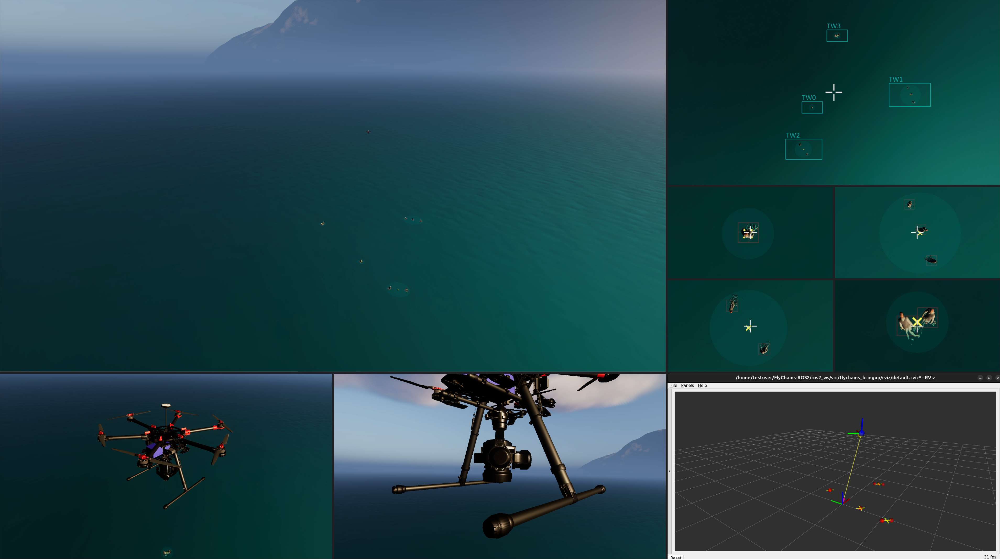
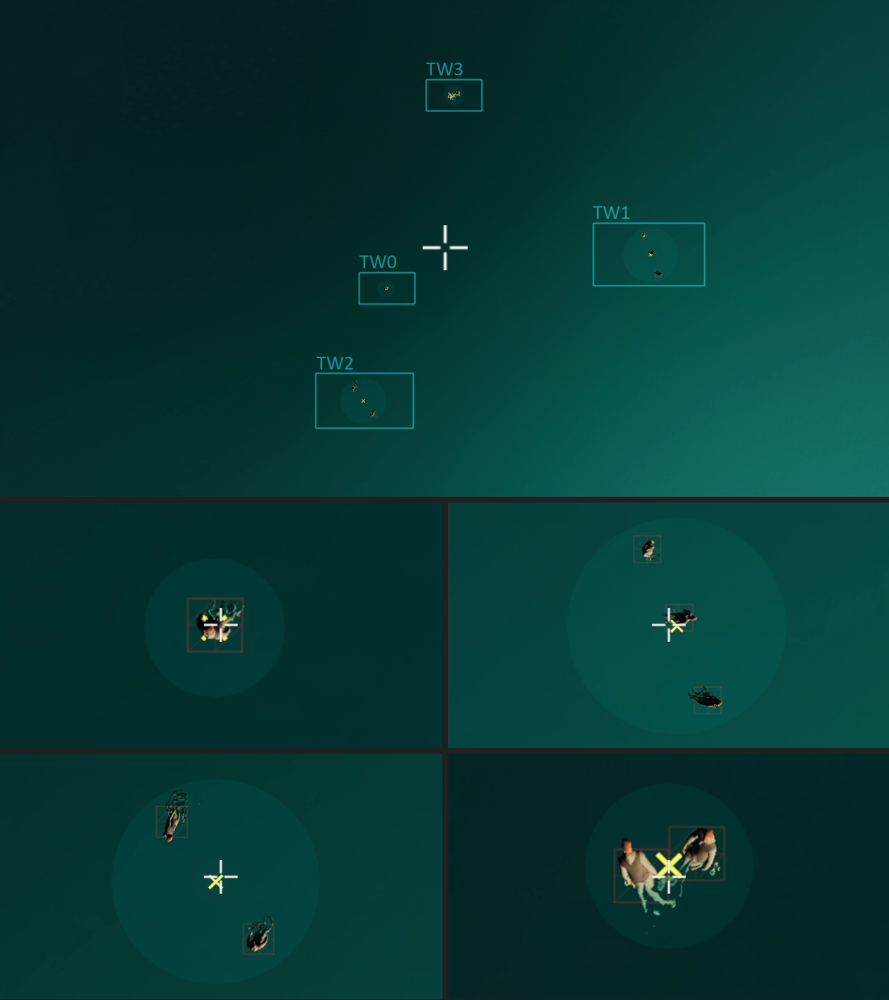
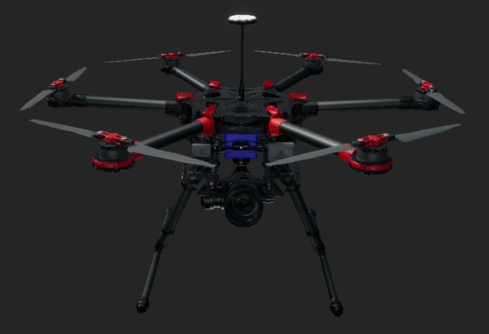

# Flying Chameleons ROS2: Multi-UAV System for Autonomous Target Tracking

[](https://docs.ros.org/en/humble/)
[](https://www.unrealengine.com/)
[](https://microsoft.github.io/AirSim/)
[](https://px4.io/)
[](https://creativecommons.org/licenses/by-nc/4.0/)

The Flying Chameleons (FlyChams) project implements a complete system for controlling and coordinating multiple UAVs equipped with modifiable tracking systems. The primary goal is to optimize target tracking through collaborative agent positioning and camera control.

The project leverages:
- **ROS2 Humble** for the distributed robotics framework
- **Unreal Engine 5** for photorealistic simulation
- **AirSim** for high-fidelity physics simulation
- **PX4** for commercial flight control
- **Pixi** for dependency and environment management

---

<div align="center">
  
  <p><em>Complete simulation view showing the UE5 environment, operator GUI, and real-time RViZ data.</em></p>
</div>

|  |  |
| :---: | :---: |
|  |  |
| *Real-time multi-target tracking windows* | *High-fidelity hexacopter model in UE5* |

## Key Features

- **Multi-agent coordination** for optimal target coverage
- **Independent control** of multiple cameras per agent
- **Clustering algorithms** for grouping and tracking targets
- **Configurable missions** via Excel configuration files
- **Realistic simulation** in photorealistic Unreal Engine environments
- **Interactive operator interface** with map visualization and camera streams

## Research

This project is part of a broader research initiative by the Department of System Engineering and Automation at the University of Seville. It is associated with the following scientific publications:

1. **Flying Chameleons: A New Concept for Minimum-Deployment, Multiple-Target Tracking Drones**
   
   *Sensors, 2022* | [DOI](https://doi.org/10.3390/s22062359)
   
   > This article introduces the innovative concept of "Flying Chameleons", autonomous aerial vehicles equipped with multiple independently steerable cameras for simultaneous tracking of multiple mobile targets. The proposal seeks to maximize efficiency in surveillance and tracking applications while minimizing resource deployment, offering an alternative to traditional approaches that require multiple vehicles or shared attention strategies.

2. **Optimal Positioning Strategy for Multi-camera, Zooming Drones**
   
   *IEEE/CAA Journal of Automatica Sinica, 2024* | [DOI](https://doi.org/10.1109/JAS.2024.124455)
   
   > This research extends the "Flying Chameleons" concept by incorporating zoom capabilities in the onboard cameras. It addresses the resulting non-convex optimization problem through convex relaxation techniques, allowing the aerial agent to dynamically adjust the focal lengths of the cameras to balance the real distance to targets with the required level of visual detail.

3. **Monitoring through Multi-camera Aerial Vehicles: A Case Study Using Unreal Engine**
   
   *Jornadas de Automática (JJAA) 2024, Málaga* | [DOI](https://doi.org/10.17979/ja-cea.2024.45.10800)
   
   > This work generalizes the multi-camera agent concept to enable collaboration among multiple agents in a single monitoring mission. Additionally, it explores the potential of Unreal Engine 5 as a photorealistic graphical simulation tool for implementing and validating the proposal. Note: This work was selected for presentation among the 6 works chosen at the Jornadas de Automática 2024 in Málaga.

## System Architecture

| Package                 | Description                                     |
| ----------------------- | ----------------------------------------------- |
| `flychams_core`         | Core domain models, utilities, and interfaces   |
| `flychams_operator`     | Operator interface GUI and visualization tools |
| `flychams_coordinator`  | Perception algorithms for clustering targets and agent assignment |
| `flychams_agent`        | Agent control, tracking, and positioning       |
| `flychams_simulation`   | Simulation framework manager and target control |
| `flychams_interfaces`   | Custom messages and services for FlyChams      |
| `airsim_wrapper`        | ROS2 interface to the AirSim simulator         |
| `airsim_interfaces`     | Custom messages and services for AirSim         |

## Prerequisites

### Software Requirements

- **Ubuntu 20.04, 22.04, or 24.04** (or compatible Linux distribution)
- **Pixi** - The project uses Pixi to manage the internal ROS2 environment and dependencies. Install from [pixi.sh](https://pixi.sh).
- **Docker** - Required for running agents in isolated containers and for PX4 SITL.
- **Unreal Engine 5.2.1** - Required for running the photorealistic simulation environment.

### Hardware Requirements

#### Simulation Mode (PC)
- **CPU**: Intel i7-12700K / AMD Ryzen 7 5800X or better
- **GPU**: NVIDIA RTX 3070 / AMD RX 6800 XT or better (for UE5)
- **RAM**: 16 GB minimum (32 GB recommended)

#### Hardware Mode (Onboard Computer)
- **Device**: NVIDIA Jetson Orin Nano Super
- **OS**: Ubuntu 22.04 (JetPack 6.0+)

## 📦 Installation

### 1. Install Pixi

```bash
curl -fsSL https://pixi.sh/install.sh | sh
```

### 2. Clone and Setup Repositories

```bash
# Main ROS2 repository
git clone https://github.com/JoseLopez36/FlyChams-ROS2.git
cd FlyChams-ROS2

# AirSim Plugin (for UE5)
git clone https://github.com/JoseLopez36/FlyChams-Cosys-AirSim.git
cd FlyChams-Cosys-AirSim
git checkout 5.2.1

# PX4 Autopilot (for Simulation)
git clone --recursive https://github.com/PX4/PX4-Autopilot.git
cd PX4-Autopilot
git checkout v1.12.0
./Tools/docker_run.sh 'make px4_sitl_default none_iris' # Build SITL
```

### 3. Setup Environment

Edit `setup.sh` to configure your paths:

```bash
export FLYCHAMS_ROS2_PATH=${HOME}/Documents/FlyChams-ROS2
export FLYCHAMS_PX4_PATH=${HOME}/Documents/PX4-Autopilot
export FLYCHAMS_AIRSIM_PATH=${HOME}/Documents/FlyChams-Cosys-AirSim
export FLYCHAMS_UE5_PATH=${HOME}/Documents/FlyChams-Sim-UE5/Linux
```

### 4. Install & Build

Install dependencies and build all packages using Pixi:

```bash
pixi install
pixi run all-build
```

### 5. Agent Setup (Simulation Only)

If running in simulation, you need to build the agent's Docker environment:

```bash
# Build the base Docker image
pixi run agent-sim-build-image

# Build the agent workspace (replace AGENT00 with your agent ID)
pixi run agent-sim-build AGENT00

# Setup and build FlyChams-Cosys-AirSim
pixi run agent-sim-shell AGENT00
cd FlyChams-Cosys-AirSim
./setup.sh
./build.sh
```

### 6. Generate Settings

Generate the initial AirSim settings based on the configuration:

```bash
pixi run generate-settings
```

## 🚀 Quick Start

The fastest way to get the system running in simulation mode:

1.  **Launch Operator Interface**:
    ```bash
    pixi run operator-sim-run
    ```

2.  **Start System via GUI. Example workflow**:
    - Press **Launch Unreal Engine 5**
    - Press **Launch Simulation Control**
    - Press **Launch Coordinator**
    - Press **Launch RViZ**
    - Press **PX4-0** (Starts flight controller for Agent 0)
    - Press **LAUNCH AGENT00** (Starts Agent 0 logic)

3.  **Stop System**:
    - Click **Stop All Processes** in the GUI.

## 🎥 Demos & Validation

**Flight Demonstration** - [📹 View Video](media/videos/Demo.mp4)  
*Target acquisition and tracking in the Unreal Engine 5 simulation environment.*

**MATLAB Test** - [📹 View Video](media/videos/MatlabTest.mp4)  
*Target acquisition and tracking in Matlab*

**Camera Gimbal Mechanics** - [📹 Gimbal Movement](media/videos/GimbalMovement.gif)  
*Independent gimbal control test*

## Detailed Usage

### Method 1: Operator Interface (GUI)

The Operator Interface is the central control hub.

```bash
pixi run operator-sim-run      # Simulation Mode
# OR
pixi run operator-hardware-run # Hardware Mode
```

**Features:**
- **Mission Control**: Start/Stop Coordinator, Simulation, Agents, etc.
- **System Logs**: Logs for each process.
- **Real-Time Map**: Real-time 2D map of agents, targets and clusters.
- **Monitoring Feeds**: Live video feeds from agent cameras.

### Method 2: Command Line (Pixi Tasks)

You can run individual components using Pixi tasks defined in `pixi.toml`.

#### Simulation & Core
```bash
pixi run simulation-ue5-run    # Launch UE5
pixi run simulation-run        # Launch Simulation Control
pixi run coordinator-sim-run   # Launch Coordinator
```

#### Agents (Docker)
Agents in simulation run inside Docker containers.

```bash
pixi run agent-sim-build-image       # Build base Docker image
pixi run agent-sim-build AGENT00     # Build workspace for AGENT00
pixi run agent-sim-run AGENT00       # Run AGENT00
pixi run agent-stream                # Stream agent feeds
```

#### PX4 (SITL)
```bash
pixi run simulation-px4-run 0  # Launch PX4 for Agent 0
```

## ⚙️ Configuration

The system uses a workflow where Excel spreadsheets drive the configuration.

1.  **Edit Configuration**: Modify Excel files in `config/` (e.g., `Configuration-TFG.xlsx`).
    - Define mission parameters.
2.  **Generate YAML**: Run the generator to create ROS2 and AirSim config files based on user configuration.
    ```bash
    pixi run generate-settings
    ```
    Files are generated in `config/generated/`.

## 📂 Directory Structure

```
FlyChams-ROS2/
├── config/             # Excel sources & generated YAMLs
├── launch/             # Python launch files
├── src/                # Source code (ROS2 packages)
│   ├── flychams_core/
│   ├── flychams_operator/
│   ├── flychams_coordinator/
│   ├── flychams_agent/
│   └── ...
├── tools/              # Helper scripts (Docker, UE5)
├── pixi.toml           # Pixi environment & task definitions
└── README.md
```

## License

Licensed under [CC BY-NC 4.0](https://creativecommons.org/licenses/by-nc/4.0/). See [`LICENSE`](LICENSE).

## Contact

Jose Francisco Lopez Ruiz - [josloprui6@alum.us.es](mailto:josloprui6@alum.us.es)
