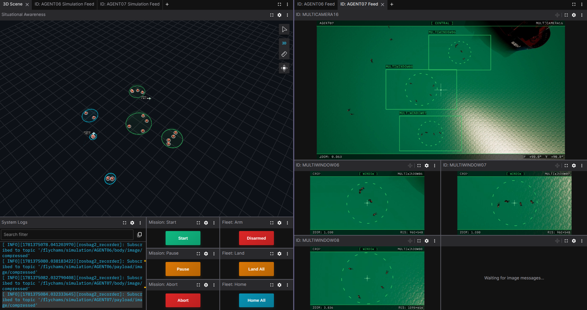
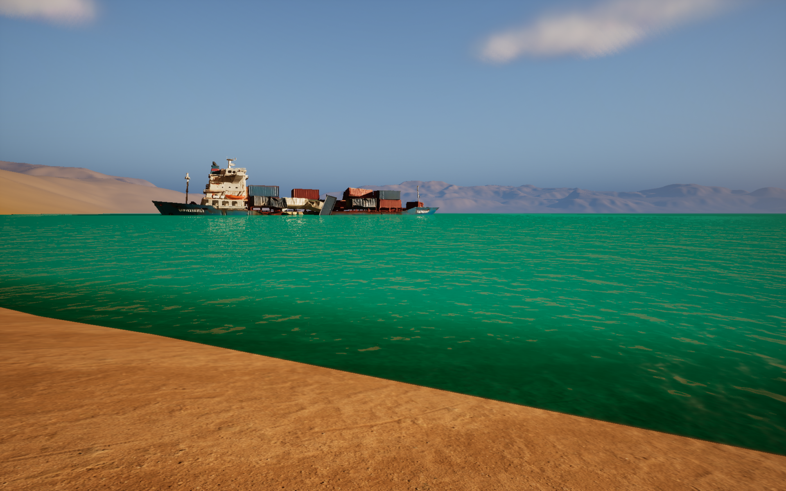
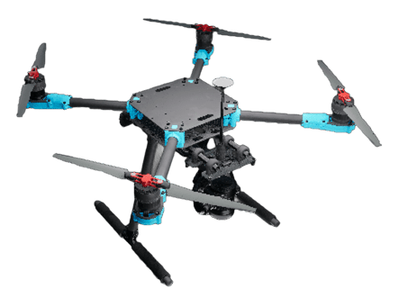

# Flying Chameleons ROS2

[](https://docs.ros.org/en/humble/)
[](https://www.unrealengine.com/)
[](https://microsoft.github.io/AirSim/)
[](https://px4.io/)
[](https://creativecommons.org/licenses/by-nc/4.0/)

The Flying Chameleons (FlyChams) project implements a complete system for controlling and coordinating multiple UAVs equipped with modifiable tracking systems. The primary goal is to optimize target tracking through collaborative agent positioning and camera control.

Built on **ROS2 Humble**, **PX4 v1.16**, **Unreal Engine 5 + AirSim**, and **Docker**.

---

<div align="center">
  
  <p><em>Foxglove operator GUI</em></p>
</div>

<div align="center">
  
  <p><em>Unreal Engine 5 simulation environment</em></p>
</div>

<div align="center">
  
  <p><em>Agent in simulation</em></p>
</div>

## Research

This project is part of a broader research initiative by the Department of System Engineering and Automation at the University of Seville. It is associated with the following scientific publications:

1. **Flying Chameleons: A New Concept for Minimum-Deployment, Multiple-Target Tracking Drones**
   
   *Sensors, 2022* | [DOI](https://doi.org/10.3390/s22062359)

   > This article introduces the innovative concept of "Flying Chameleons", autonomous aerial vehicles equipped with multiple independently steerable cameras for simultaneous tracking of multiple mobile targets. The proposal seeks to maximize efficiency in surveillance and tracking applications while minimizing resource deployment, offering an alternative to traditional approaches that require multiple vehicles or shared attention strategies.

2. **Optimal Positioning Strategy for Multi-camera, Zooming Drones**
   
   *IEEE/CAA Journal of Automatica Sinica, 2024* | [DOI](https://doi.org/10.1109/JAS.2024.124455)

   > This research extends the "Flying Chameleons" concept by incorporating zoom capabilities in the onboard cameras. It addresses the resulting non-convex optimization problem through convex relaxation techniques, allowing the aerial agent to dynamically adjust the focal lengths of the cameras to balance the real distance to targets with the required level of visual detail.

3. **Monitoring through Multi-camera Aerial Vehicles: A Case Study Using Unreal Engine**

   *Jornadas de Automática (JJAA) 2024, Málaga* | [DOI](https://doi.org/10.17979/ja-cea.2024.45.10800)
   
   > This work generalizes the multi-camera agent concept to enable collaboration among multiple agents in a single monitoring mission. Additionally, it explores the potential of Unreal Engine 5 as a photorealistic graphical simulation tool for implementing and validating the proposal. Note: This work was selected for presentation among the 6 works chosen at the Jornadas de Automática 2024 in Málaga.

## Demos

The following videos showcase FlyChams in different configurations, from a single multi-camera drone to coordinated multi-agent fleets tracking multiple targets simultaneously. Each demo highlights a specific aspect of the system's capabilities.

### Single Agent

- **Single Agent — Multi-Camera** — [View Video](media/videos/SingleAgent-MultiCamera.mp4)
- **Single Agent — Multi-Window** — [View Video](media/videos/SingleAgent-MultiWindow.mp4)

### Multi-Agent

- **Multi-Agent — Multi-Camera** — [View Video](media/videos/MultiAgent-MultiCamera.mp4)
- **Multi-Agent — Multi-Window** — [View Video](media/videos/MultiAgent-MultiWindow.mp4)
- **Multi-Agent — Hybrid** — [View Video](media/videos/MultiAgent-Hybrid.mp4)

### Recordings

MCAP bag recordings for each demo are available on Zenodo:

[](https://doi.org/10.5281/zenodo.20382819)

Download and extract them into the `recordings/` directory to replay in [Foxglove Studio](https://foxglove.dev/).

## Architecture

| Package | Description |
|---|---|
| `flychams_api` | Custom `.msg` definitions |
| `flychams_common` | Shared base classes, types, utilities, algorithms |
| `flychams_coordinator` | Target clustering and agent assignment |
| `flychams_agent` | Per-UAV control, tracking, and positioning |
| `flychams_simulation` | AirSim bridge, target control, scenario streaming |
| `flychams_operator` | Metrics, visualization markers, Foxglove bridge |

## Prerequisites

### Software

- **Ubuntu 22.04 or 24.04**
- **Docker** (NVIDIA: [Container Toolkit](https://docs.nvidia.com/datacenter/cloud-native/container-toolkit/latest/install-guide.html) · AMD: `/dev/kfd` + `/dev/dri` access)
- **PX4 v1.16 + Micro-XRCE-DDS Agent v2.4.3** — see [docs/autopilot.md](docs/autopilot.md)
- **FlyChams-Sim-UE5** binary — see [docs/simulator.md](docs/simulator.md)

### Hardware (simulation)

- **CPU**: i7-12700K / Ryzen 7 5800X or better
- **GPU**: RTX 3070 / RX 6800 XT or better
- **RAM**: 32 GB recommended (16 GB minimum)

### Hardware (onboard)

- NVIDIA Jetson Orin Nano Super · Ubuntu 22.04 (JetPack 6.0+)

## Quick Start

Clone the repository:

```bash
git clone https://github.com/JoseLopez36/FlyChams-ROS2.git
cd FlyChams-ROS2
```

Follow the steps in the documentation:

1. Build Docker images and ROS2 workspaces — [docs/setup.md](docs/setup.md)
2. Set up PX4 and Micro-XRCE-DDS — [docs/autopilot.md](docs/autopilot.md)
3. Launch the simulator — [docs/simulator.md](docs/simulator.md)
4. Launch the stack — [docs/launch.md](docs/launch.md)

Easy way to launch:

```bash
scripts/flychams.py sim          # start simulation
scripts/flychams.py sim --record # start with MCAP recording
scripts/stop.sh                  # stop everything
```

## Configuration

Edit the Excel spreadsheet in `src/flychams_common/config/`, then regenerate:

```bash
scripts/launch_settings.sh
```

See `src/flychams_common/config/core/system.yaml` for all configurable paths and parameters.

## Directory Structure

```
FlyChams-ROS2/
├── docker/             # Dockerfiles (layered: base → gpu → roles)
├── docs/               # Documentation
├── matlab/             # Trajectory generation and recording analysis
├── scripts/            # Build, launch, stop, and log helpers
└── src/                # ROS2 packages
    ├── flychams_api/
    ├── flychams_common/
    ├── flychams_coordinator/
    ├── flychams_agent/
    ├── flychams_operator/
    └── flychams_simulation/
```

## Documentation

| File | Contents |
|---|---|
| [docs/setup.md](docs/setup.md) | Docker images, workspace builds, settings generation, env vars, DDS tuning |
| [docs/launch.md](docs/launch.md) | Launching, stopping, inspecting logs |
| [docs/autopilot.md](docs/autopilot.md) | PX4 and Micro-XRCE-DDS Agent setup |
| [docs/simulator.md](docs/simulator.md) | UE5/AirSim setup and optimization flags |
| [docs/foxglove.md](docs/foxglove.md) | Foxglove Studio operator interface |
| [docs/matlab.md](docs/matlab.md) | MATLAB trajectory generation and recording analysis |
| [docs/performance.md](docs/performance.md) | Hardware utilisation benchmarks (CPU, GPU, RAM, VRAM) |

## License

Licensed under [CC BY-NC 4.0](https://creativecommons.org/licenses/by-nc/4.0/). See [`LICENSE`](LICENSE).

## Contact

Jose Francisco Lopez Ruiz — [josloprui6@alum.us.es](mailto:josloprui6@alum.us.es)